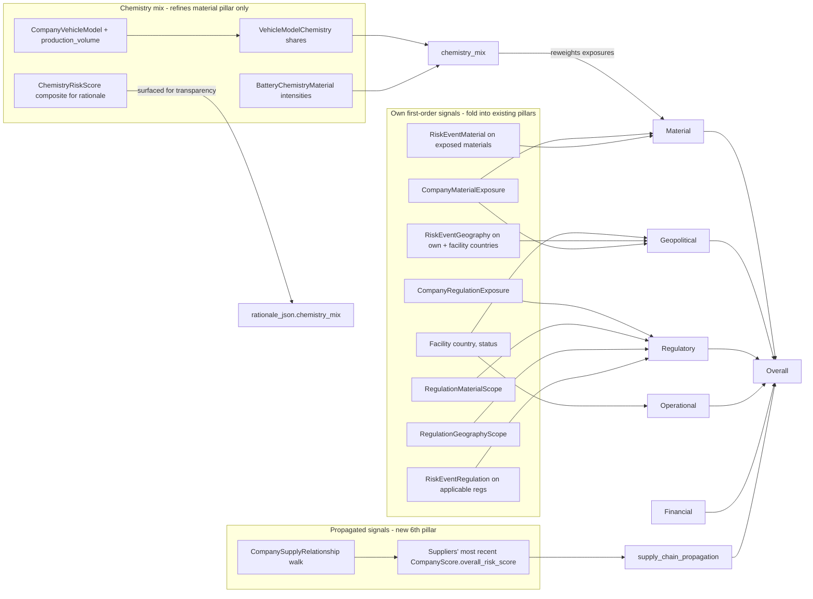

## Why fold-in + sixth pillar + chemistry-as-refinement (not 7th pillar)

You asked for "most accurate and transparent". Three different signals, three different placements:

- **Fold into existing pillars** anything that is a *first-order* fact about the company itself: its facilities' countries, regulations whose scope covers its materials/geos, events tagged to those geos/materials.
- **New sixth pillar `supply_chain_propagation`** captures only true *second-party* risk: the weighted rollup of *other companies'* current `CompanyScore` rows reachable via `CompanySupplyRelationship`. This makes the line "Tesla's score went up because CATL got hit" explicit and tunable.
- **Chemistry mix is NOT a new pillar.** Chemistry isn't a different *category* of risk — it's the most accurate signal we have for *which* materials a company is actually exposed to. A 60% LFP / 40% NMC OEM and a 100% NMC OEM both currently produce identical material-pillar scores if their `CompanyMaterialExposure` rows look the same; they shouldn't. So chemistry feeds into the material aggregator as an exposure-weighting input, and is surfaced separately in `rationale_json.chemistry_mix` (with each chemistry's persisted `ChemistryRiskScore.composite_risk_score`) so the UI can show the breakdown without giving it pillar weight.



## Step 1 — Schema (two Alembic migrations)

### `006_supply_chain_rollup.py`

- Add `risk_event_facilities` junction table (currently missing): `id`, `risk_event_id` (FK + cascade), `facility_id` (FK + cascade), `relevance_score Float NOT NULL`, `match_reason Text`, `created_at`, with indexes on each FK and a UNIQUE on `(risk_event_id, facility_id)`. Mirror the shape of `RiskEventGeography` in [app/models/regulatory.py](app/models/regulatory.py) lines 326-337.
- Add columns to `company_scores`: `supply_chain_propagation_score Float NULL`, `propagation_depth_used Int NULL`. Backfill `NULL` for old rows; treat `NULL` as "feature off" in the API layer.
- Add `RiskEventFacility` ORM in [app/models/regulatory.py](app/models/regulatory.py) and export from [app/models/__init__.py](app/models/__init__.py).
- Bump `SCORING_VERSION` to `"3.0"` in [app/services/scoring/supplier_risk.py](app/services/scoring/supplier_risk.py).

### `007_company_vehicle_models.py`

Two new tables — product-level grain so `Tesla.Model 3 Long Range = NMC, Tesla.Model 3 Standard = LFP`:

- `company_vehicle_models`: `id`, `company_id` (FK companies), `model_name Text NOT NULL`, `model_year_start Int`, `model_year_end Int NULL`, `production_volume_units Int NULL`, `production_volume_year Int NULL`, `is_active Boolean DEFAULT true`, `data_source Text`, `metadata_json JSONB`, `created_at`, `updated_at`. UNIQUE `(company_id, model_name, model_year_start)`.
- `vehicle_model_chemistries`: `id`, `vehicle_model_id` (FK + cascade), `battery_chemistry_id` (FK), `share_pct Float NOT NULL CHECK (share_pct > 0 AND share_pct <= 1)`, `valid_from Date`, `valid_to Date NULL`, `notes Text`, `created_at`, `updated_at`. UNIQUE `(vehicle_model_id, battery_chemistry_id, valid_from)`.

Add `CompanyVehicleModel` and `VehicleModelChemistry` ORMs to a new `app/models/vehicle.py` (or extend `app/models/company.py`) and export from `app/models/__init__.py`.

Production volume is left nullable — when missing, models contribute equally to the company-level mix (uniform default). When present, mix is volume-weighted. No automated ingestion in this PR; a small hand-seeded fixture for the top 5 OEMs is enough to validate the pipeline.

## Step 2 — New evidence queries in [app/services/scoring/evidence_query.py](app/services/scoring/evidence_query.py)

All read-only, all category-windowed via `_category_window_cutoff`, all returning `EventWithRelevance` lists or lightweight tuples to keep the aggregator pure.

- `get_facilities_for_company(db, company_id) -> list[Facility]` — direct read from `Facility.company_id`. Used by both geo and operational aggregation.
- `get_events_for_geographies(db, country_codes: set[str], category, as_of) -> list[EventWithRelevance]` — JOIN through `RiskEventGeography`, dedupe by `RiskEvent.id`, return max `relevance_score` per event.
- `get_events_for_materials(db, material_ids: set[int], category, as_of) -> list[EventWithRelevance]` — JOIN through `RiskEventMaterial`, dedupe similarly.
- `get_regulations_scoping_company(db, company_id, material_ids, country_codes) -> list[tuple[str, float]]` — UNION of:
  1. existing `CompanyRegulationExposure` rows (status-weighted, current behavior),
  2. `Regulation` rows reachable via `RegulationMaterialScope.material_id IN material_ids`,
  3. `Regulation` rows reachable via `RegulationGeographyScope.country_code IN country_codes`.

  Scope-only (no exposure row) hits return weight `0.50` (same convention as `unknown` compliance status). De-dup by `regulation_key`, keeping the max weight.
- `get_events_for_regulations(db, regulation_keys, as_of) -> list[EventWithRelevance]` — JOIN through `RiskEventRegulation`.
- `get_supplier_chain(db, root_company_id, max_depth=2, max_visited=50) -> list[SupplierEdge]` — BFS over `CompanySupplyRelationship.buyer_id == current`, returning a typed dataclass per visited supplier:

  ```python
  @dataclass
  class SupplierEdge:
      supplier_id: uuid.UUID
      depth: int                      # 1, 2, ...
      cumulative_volume_share: float  # product of edge volume_share_pct down the path
      path: list[uuid.UUID]           # for cycle detection + rationale
  ```

  Cycle guard: skip any node already in `path`. Hard cap at `max_visited` to bound runtime.
- `get_latest_company_scores(db, company_ids: list[uuid.UUID]) -> dict[uuid.UUID, CompanyScore]` — single query returning the most recent `CompanyScore` per company (`DISTINCT ON company_id ORDER BY as_of_date DESC`). The propagation pillar consumes only persisted scores; never recurse into rescore.

### Chemistry helpers (also new in `evidence_query.py`)

- `get_vehicle_models_for_company(db, company_id) -> list[CompanyVehicleModel]` — eager-load `vehicle_model_chemistries`. Filter `is_active = true`.
- `get_chemistry_mix_for_company(db, company_id) -> Optional[dict[int, float]]` — derives a normalized chemistry-share map keyed by `battery_chemistry_id`. Algorithm:
  1. For each active model, sum `share_pct` per chemistry across rows where `valid_from <= today AND (valid_to IS NULL OR valid_to > today)`. (A model can have multiple chemistries by trim; shares within a model must sum to 1.0.)
  2. Weight each model's per-chemistry shares by `production_volume_units` (default `1` if NULL — uniform).
  3. Normalize the company-level totals to sum to 1.0.
  4. Return `None` if no vehicle models exist for the company. Aggregator interprets `None` as "fall back to legacy uniform behavior" — never substitute market-share defaults from `BatteryChemistry.current_market_share_pct` (those are *industry* averages and would silently inject signal that isn't about this company).
- `get_chemistry_material_intensities(db, chemistry_ids, as_of_date) -> dict[int, dict[int, float]]` — for each chemistry, returns its `BatteryChemistryMaterial.material_id -> intensity` map filtered by `valid_from/valid_to` containing `as_of_date`. This is what makes the weighting time-aware (chemistries' material recipes shift as the industry moves to high-Ni or LMFP variants).
- `get_latest_chemistry_risk_scores(db, chemistry_ids) -> dict[int, ChemistryRiskScore]` — most recent per chemistry, used only to populate `rationale_json.chemistry_mix`. Does NOT feed pillar math.

## Step 3 — Enrich the four "fold-in" aggregators in [app/services/scoring/evidence_aggregator.py](app/services/scoring/evidence_aggregator.py)

Existing aggregator signatures change to accept the new inputs but keep the same output tuple shapes so pillar scorers don't change. Each aggregator gains an extra optional argument with a safe default so existing call sites still work during the transition.

- `derive_material_inputs(material_exposures, trade_events, as_of_date, *, material_country_events=None, chemistry_mix=None, chemistry_intensities=None)`:
  - **Chemistry weighting (new).** When `chemistry_mix` and `chemistry_intensities` are both present, build a `material_id -> chemistry_weight` map where `chemistry_weight[material_id] = sum_over_chemistries(chemistry_mix[c] * chemistry_intensities[c].get(material_id, 0.0))`. Then for every `CompanyMaterialExposure` row used in this aggregator:
    - Multiply its `exposure_score` by `chemistry_weight.get(exposure.material_id, baseline_unmatched)` before averaging into `criticality`. `baseline_unmatched = 0.10` so a material the company holds an exposure on but that *no* chemistry uses (e.g. a legacy alloy line, a non-battery business material) is not zeroed out — it counts at 10%.
    - Use the same per-exposure weight as the count divisor for `concentration` so the HCG-share is computed over the chemistry-relevant material set, not over all materials uniformly.
  - When `chemistry_mix is None` (no vehicle models seeded for this company) the function behaves exactly as today — no regression for non-OEM companies (e.g. mining cos, refiners).
  - `trade_volatility` now averages over the union of `trade_events` and `material_country_events` (events tagged to either the company directly or to a `(material, country)` the company is exposed to). Already-deduped by event id in the query layer. Trade volatility is NOT chemistry-weighted — a lithium tariff is a lithium tariff regardless of which buyer's chemistry recipe touches it.

- `derive_geopolitical_inputs(trade_events, material_exposures, as_of_date, *, facilities=None, geo_events=None)`:
  - `country_concentration` becomes a weighted blend: 50% from `material_exposures.source_geography` HCG share, 50% from `facilities.country` HCG share. Both default to 0.5 if missing.
  - `export_restriction_exposure` and `tariff_exposure` widen their candidate event pool to include `geo_events` (events linked via `RiskEventGeography` to either source-geo or facility countries), classified by the same subtype/keyword logic at [app/services/scoring/evidence_aggregator.py](app/services/scoring/evidence_aggregator.py) lines 178-194.

- `derive_regulatory_inputs(regulatory_events, active_obligations, as_of_date, *, scope_obligations=None, regulation_events=None)`:
  - `active_obligations` is now the de-duped UNION of structured exposures (existing) and scope-derived obligations (new), so a regulation that scopes lithium auto-applies to a lithium-exposed company at weight 0.50 even without a manual `CompanyRegulationExposure` row.
  - `top_event_impacts` averages events from BOTH `regulatory_events` (company-tagged) AND `regulation_events` (events linked via `RiskEventRegulation` to any regulation in the active set). Same `_impact()` calc, dedup by `event.id`.

- `derive_operational_inputs(operational_events, as_of_date, *, facilities=None, facility_country_events=None)`:
  - `structural_dependency` rises if a company has ≥1 `Facility` whose status is `under_construction` or `planned` (signals capacity-not-yet-online dependency). Concretely: `max(existing_struct_dep, 0.4 * share_of_non_operating_facilities)`.
  - `weighted_event_impacts` extended to include events tagged to facility countries (already retrieved via `get_events_for_geographies` for the operational category window).

## Step 4a — Chemistry-aware material refinement (worked example)

Walking through Tesla as a sanity check on the math:

- Tesla vehicle models seeded: `Model 3 (LFP, 350k units/yr)`, `Model Y (NMC, 800k units/yr)`, `Cybertruck (NMC, 50k units/yr)`.
- Volume-weighted chemistry mix: `LFP = 350 / 1200 = 0.292`, `NMC = 850 / 1200 = 0.708`.
- `BatteryChemistryMaterial` intensities (illustrative, real values come from the table): `LFP = {Li: 0.10, Fe: 0.30, P: 0.20}`, `NMC = {Li: 0.10, Ni: 0.40, Co: 0.10, Mn: 0.10}`.
- Per-material chemistry weight Tesla actually consumes:
  - `Li = 0.292 * 0.10 + 0.708 * 0.10 = 0.100`
  - `Fe = 0.292 * 0.30 = 0.088`
  - `P  = 0.292 * 0.20 = 0.058`
  - `Ni = 0.708 * 0.40 = 0.283`
  - `Co = 0.708 * 0.10 = 0.071`
  - `Mn = 0.708 * 0.10 = 0.071`

If today Tesla had identical `CompanyMaterialExposure` rows for cobalt and lithium, both with `exposure_score = 0.8`, the *current* aggregator counts them equally (each 0.8). After this change, lithium contributes `0.8 * 0.100 = 0.080` and cobalt contributes `0.8 * 0.071 = 0.057` — small relative shift today, but a 100% LFP OEM would see cobalt drop to roughly 0 and lithium dominate, which is the qualitative outcome you want.

This is the entire chemistry effect — no new pillar, no weight retuning, just a sharper `criticality`/`concentration` computation that finally reflects "what battery does this company actually put in its cars".

## Step 4b — New propagation pillar

New file [app/services/scoring/propagation_risk.py](app/services/scoring/propagation_risk.py). Pure function, no DB:

```python
DEFAULT_DEPTH_WEIGHTS = (1.00, 0.40)  # tier-1 fully counted, tier-2 at 40%

def score_propagation(
    supplier_contributions: list[tuple[float, float, int]],
    # each tuple = (supplier_overall_score 0-100, edge_volume_share 0-1, depth)
    depth_weights: tuple[float, ...] = DEFAULT_DEPTH_WEIGHTS,
) -> float:
    """0-100. Volume-weighted, depth-decayed average of supplier overall scores.

    Conservative volume default: missing volume_share_pct -> 0.10 so that
    unknown-volume edges contribute meaningfully but cannot dominate.
    """
```

Aggregator helper in [app/services/scoring/evidence_aggregator.py](app/services/scoring/evidence_aggregator.py):

```python
def derive_propagation_inputs(
    supplier_chain: list[SupplierEdge],
    latest_scores: dict[uuid.UUID, CompanyScore],
) -> list[tuple[float, float, int]]:
    """Drop edges with no persisted CompanyScore (skipped, surfaced in rationale)."""
```

## Step 5 — Aggregate (sixth pillar)

In [app/services/scoring/supplier_risk.py](app/services/scoring/supplier_risk.py) update `PILLAR_WEIGHTS` so all six sum to 1.0. Default proposal:

- `material 0.25` (was 0.30)
- `geopolitical 0.20`
- `regulatory 0.20`
- `operational 0.10` (was 0.15)
- `financial 0.10` (was 0.15)
- `supply_chain_propagation 0.15` (new)

Reasoning: keep material as the heaviest single pillar; carve the new 15% mostly out of operational + financial (which are typically the sparsest signals today) so the *total* exposure of a company that has no propagation signal yet doesn't artificially deflate.

When `propagation_score is None` (e.g. company has no suppliers in the graph), normalize the remaining five pillars to sum to 1.0 so single-tier companies aren't penalized. Persist `supply_chain_propagation_score = NULL` and `propagation_depth_used = NULL` in that case so the UI can show "no upstream signal".

## Step 6 — Orchestrator parameters & flow in [app/services/scoring/orchestrator.py](app/services/scoring/orchestrator.py)

Extend `rescore_company` signature:

```python
def rescore_company(
    db, company_id, run_id, as_of_date=None,
    *,
    propagation_max_depth: int = 2,
    propagation_max_suppliers: int = 50,
    propagation_depth_weights: tuple[float, ...] = (1.00, 0.40),
) -> CompanyScore: ...
```

Pipeline becomes:

1. As today: pull `material_exposures`, `trade_events`, `regulatory_events`, `operational_events`, `filing_events`, `active_obligations`.
2. NEW: pull `facilities`, derive `material_ids` and `country_set` (union of source_geography + facility countries).
3. NEW: pull `geo_events`, `material_country_events`, `scope_obligations`, `regulation_events`.
4. NEW: pull `supplier_chain` and `latest_scores` for those suppliers.
5. NEW: pull `chemistry_mix` (volume-weighted from `CompanyVehicleModel` + `VehicleModelChemistry`) and `chemistry_intensities` (from `BatteryChemistryMaterial` filtered to `as_of_date`). Both `None`-tolerant.
6. Pass enriched inputs into the four updated aggregators (existing pillars). Material aggregator additionally receives `chemistry_mix` + `chemistry_intensities`.
7. NEW: compute `propagation_score` via `derive_propagation_inputs` + `score_propagation`.
8. Aggregate six pillars (with normalization fallback when propagation is `None`).
9. NEW: pull `latest_chemistry_risk_scores` for the chemistries in the mix and build the `chemistry_mix` rationale block.
10. Persist new columns; rationale gets `propagation_chain`, `chemistry_mix`, and a `signals_used` block with counts of new evidence types so the UI can show "X scope-based regs, Y facility-country events, Z propagated suppliers, W chemistries weighted".

## Step 7 — Rationale schema

In [app/services/scoring/types.py](app/services/scoring/types.py):

- Extend `ComponentScores` with `supply_chain_propagation: Optional[float]`.
- Add `PropagationContribution(supplier_id, supplier_name, depth, edge_volume_share, supplier_overall_score, supplier_score_as_of_date)` and `propagation_chain: list[PropagationContribution]` field on `SupplierScoreRationale`.
- Add `ChemistryMixContribution(battery_chemistry_id, chemistry_slug, share_pct, composite_risk_score, score_as_of_date)` and `chemistry_mix: list[ChemistryMixContribution]` field on `SupplierScoreRationale`. Even though chemistry doesn't get a pillar, the UI needs to show "Tesla's mix is 71% NMC / 29% LFP, NMC's persisted composite risk is 58, LFP's is 41" so users can see *why* the material pillar moved when chemistry data was added.

This is the transparency story: every score row can be inspected to see exactly which supplier added what risk and which chemistries shaped the material picture.

## Step 8 — Tests

- `tests/scoring/test_evidence_query_supply_chain.py`: `get_supplier_chain` cycle/depth/cap behavior; `get_regulations_scoping_company` UNION semantics; `get_latest_company_scores` returns the most recent per company.
- `tests/scoring/test_aggregator_facility_geo.py`: facility countries change `country_concentration`; `RiskEventGeography` events feed `geopolitical` even without `RiskEventCompany`.
- `tests/scoring/test_aggregator_scope_regulations.py`: a regulation linked only via `RegulationMaterialScope` shows up as an active obligation at weight 0.50.
- `tests/scoring/test_propagation_risk.py`: `score_propagation` with mixed depths, missing volumes, empty chain.
- `tests/scoring/test_orchestrator_propagation.py`: end-to-end with a fixture Tesla -> CATL chain; flipping CATL's persisted overall from 30 to 80 must move Tesla's `supply_chain_propagation_score` and `overall_risk_score` upward; both `rationale_json.propagation_chain[0].supplier_id == CATL.id` and `propagation_depth_used == 1` must be set.
- Snapshot-style test that confirms a company with NO suppliers normalizes weights and produces a score within 5% of pre-change behavior on a stable fixture (regression guard).

## Step 9 — Docs

Update [docs/scoring.md](docs/scoring.md) "Data Flow" section (line 219+) with the new flowchart and a "Sixth pillar: supply_chain_propagation" subsection. Append a "Scoring v3.0 changelog" entry covering the weight shift, new pillar, and new evidence sources. Cross-link from [docs/seed-review.md](docs/seed-review.md) (the `supply_relationship` and `facility` reviewers' findings now feed real scoring inputs, not just review queues).

## Step 10 — `ScoringScope` hook (built in this PR; UI-ready)

Goal: any future "show me Tesla's LFP-only risk" or "Tesla's risk from Li sourced from DRC" UI is one wiring change away — no math, no schema, no migration needed at that point.

### `ScoringScope` dataclass in [app/services/scoring/types.py](app/services/scoring/types.py)

```python
from dataclasses import dataclass, field
from typing import ClassVar, Optional
import uuid

@dataclass(frozen=True)
class ScoringScope:
    """Optional filters applied uniformly across the scoring pipeline.

    None on a field means 'no filter for this dimension'. ScoringScope.ALL
    is the no-op sentinel; passing it MUST produce identical results to
    today's pre-scope behavior (regression-tested explicitly).
    """
    material_ids:        Optional[frozenset[int]]       = None
    country_codes:       Optional[frozenset[str]]       = None
    chemistry_ids:       Optional[frozenset[int]]       = None
    regulation_keys:     Optional[frozenset[str]]       = None
    facility_ids:        Optional[frozenset[uuid.UUID]] = None
    supplier_depth_max:  Optional[int]                  = None  # caps BFS depth

    ALL: ClassVar["ScoringScope"]  # filled below

    def is_all(self) -> bool:
        return all(getattr(self, f) is None for f in (
            "material_ids", "country_codes", "chemistry_ids",
            "regulation_keys", "facility_ids", "supplier_depth_max",
        ))

ScoringScope.ALL = ScoringScope()
```

### Threading into `evidence_query.py`

Every new helper added in Step 2 — and the existing `get_events_for_company`, `get_company_material_exposure`, `get_active_compliance_obligations`, `get_filing_signals`, `get_events_for_material` — gains `scope: ScoringScope = ScoringScope.ALL` as the last kwarg. Concrete filter rules:

- `get_company_material_exposure`: if `scope.material_ids is not None`, add `AND material_id IN scope.material_ids`. If `scope.country_codes is not None`, add `AND source_geography IN scope.country_codes`.
- `get_events_for_geographies`: if `scope.country_codes is not None`, intersect the requested countries with it before the JOIN.
- `get_events_for_materials`: same, with `material_ids`.
- `get_regulations_scoping_company`: if `scope.regulation_keys is not None`, filter the UNION result.
- `get_events_for_regulations`: filter regulation set first.
- `get_facilities_for_company`: if `scope.facility_ids is not None`, add `AND id IN scope.facility_ids`.
- `get_supplier_chain`: respect `scope.supplier_depth_max` as a hard cap on BFS depth.
- `get_chemistry_mix_for_company`: if `scope.chemistry_ids is not None`, restrict the model→chemistry JOIN to those IDs and re-normalize the resulting share map to sum to 1.0 (so chemistry_ids={LFP} returns `{LFP: 1.0}` regardless of how much LFP the company actually uses — this is the "what if it were 100% LFP" view).

Filters compose: a scope with `material_ids={Li}` AND `country_codes={"CD"}` means lithium-from-DRC.

### Orchestrator changes in [app/services/scoring/orchestrator.py](app/services/scoring/orchestrator.py)

```python
def rescore_company(
    db, company_id, run_id, as_of_date=None,
    *,
    propagation_max_depth: int = 2,
    propagation_max_suppliers: int = 50,
    propagation_depth_weights: tuple[float, ...] = (1.00, 0.40),
    scope: ScoringScope = ScoringScope.ALL,
    persist: bool = True,
) -> CompanyScore: ...
```

Hard rule, enforced at the top of the function:

```python
if not scope.is_all() and persist:
    log.warning("orchestrator.scoped_run_forced_to_non_persist", ...)
    persist = False
```

This is the single non-negotiable: **scoped runs never write to `company_scores`**. The time-series only ever contains comparable, full-scope rows. Skip the `db.flush()` call when `persist=False` and return the in-memory `CompanyScore` object (id stays `None`).

`scope` is passed straight through to every `get_*` call. The aggregators don't need to know about it — they just receive already-filtered inputs.

### `score_company_scoped` thin wrapper

```python
def score_company_scoped(
    db, company_id, scope: ScoringScope, as_of_date=None,
    run_id: Optional[str] = None,
) -> CompanyScore:
    """UI-facing entry point for scoped, never-persisted previews."""
    return rescore_company(
        db, company_id, run_id or f"scoped-{uuid.uuid4()}", as_of_date,
        scope=scope, persist=False,
    )
```

### Scope-aware propagation caveat

When `scope != ScoringScope.ALL`, the propagation pillar must NOT use suppliers' persisted `CompanyScore.overall_risk_score` (those were computed under `scope=ALL` and would silently mix unscoped supplier risk into a scoped Tesla view). Two options:

1. **v1 (this PR):** when `scope != ALL`, set `supply_chain_propagation_score = None` and add a `propagation_skipped_due_to_scope: True` flag in `rationale_json.signals_used`. Other five pillars still respond to scope. This is a known, documented limitation — fine for MVP UI.
2. **v2 (follow-up):** recursively call `rescore_company(supplier_id, scope=scope, persist=False)` for each tier, with a per-`(company_id, scope_hash)` LRU cache. More expensive, more correct.

Document v1 in `docs/scoring.md`. v1 ships now; v2 is a clean follow-up.

### Forward-looking note (still in `docs/scoring.md`)

The seven UI-level filter dimensions worth surfacing in priority order: chemistry → material → material+source-country pair → regulation_key → supplier-tier → facility → time-window. Anything else can be added without schema changes — just a new field on `ScoringScope`.

## Out of scope (call out so it doesn't creep in)

- No changes to `chemistry_risk.py` (separate pipeline). It continues to *produce* `ChemistryRiskScore` rows; this PR only *consumes* the latest one for rationale display.
- No `MaterialAlternative` substitution-risk modeling (no model exists yet).
- No new ingestion to populate `risk_event_facilities` — the migration adds the table; populating it is a follow-up ingest task (entity_resolution.py would gain a facility-matching pass).
- No automated ingestion for `company_vehicle_models` / `vehicle_model_chemistries` — a hand-seeded fixture for the top OEMs (Tesla, BYD, GM, Ford, VW, Hyundai/Kia, Stellantis) is enough to validate the pipeline. A future PR can pull from EV-volumes.com / Marklines / company filings.
- No `MaterialAlternative` substitution risk — chemistry mix already implicitly captures "this company can substitute LFP for NMC if cobalt spikes" because the share will move; we're not modeling the *option* to substitute, only the *current* mix.
- No automatic re-rescoring of buyers when a supplier's score changes — that's a queue/triggering concern handled by the existing manual-rescore endpoint plus a future "rescore downstream buyers" job.
- No 7th pillar for chemistry. Per design choice, chemistry sharpens the material pillar only; it does not get its own weight in `PILLAR_WEIGHTS`.
- No scope-aware propagation in v1 (Step 10): when `scope != ScoringScope.ALL` the propagation pillar is skipped (set to `None`) and flagged in `rationale_json.signals_used`. The recursive scope-respecting propagation with per-scope LRU cache is a clean follow-up PR.
- No UI / HTTP endpoint built in this PR. `score_company_scoped()` is the single Python-level entry point; wiring it to a route is a UI PR concern.
