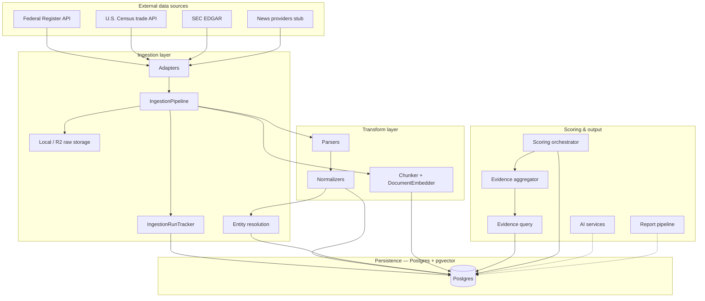

# Architecture overview

> **Last updated: April 2026**

This project implements a **supply chain intelligence** backend: ingest and normalize heterogeneous sources into Postgres, emit structured risk events, score companies across five risk pillars, and expose an internal FastAPI for orchestration and triggering. Multi-tenancy, auth (Clerk), and customer-facing surfaces are defined in the schema but not yet wired into the API layer.

## Layered architecture



**Design intent**

1. **Adapters** only talk to the outside world and return **`FetchBundle`** objects (raw bytes + logical items). They do not write to the database.
2. **`IngestionPipeline`** is the single orchestrator: merge config, track runs, persist raw payloads, upsert `source_documents`, write domain rows, and attach risk events via entity resolution.
3. **Entity resolution** (`app/services/ingestion/entity_resolution.py`) determines which companies are relevant to each new `RiskEvent` and writes `risk_event_companies` junction rows with per-company relevance scores.
4. **Parsers** turn source-specific dicts into small internal dataclasses (`ParsedRegulation`, `ParsedFiling`, etc.).
5. **Normalizers** resolve geography, materials, and companies, and produce **`RiskEventDraft`** structures for ORM insert.
6. **Document embedder** chunks `source_documents.raw_text` and stores 1536-dim vectors in `document_chunks.embedding` (pgvector) for semantic search.
7. **Scoring orchestrator** (`app/services/scoring/orchestrator.py`) runs automatically after each ingestion run for every company touched by new events. It queries evidence, aggregates inputs, scores all five pillars, and appends a `company_scores` row. A `POST /companies/{id}/rescore` endpoint triggers on-demand rescoring.
8. **Reports** and **AI** modules are interfaces + stubs so OpenAI or other providers can replace local logic without reshaping the pipeline.

## Phased sources

| Phase | Role | Implementation |
|-------|------|----------------|
| **1** | Federal Register, Census trade, SEC EDGAR, news stub | Live adapters + pipeline handlers |
| **2** | Sustainability PDFs, policy HTML, NGO/IEA reports | Adapter classes present; `fetch` raises `NotImplementedError` |
| **3** | NREL/AFDC charging, USITC, Canada policy | Same pattern as Phase 2 |

`Source.phase` and `sources.is_active` gate what runs in production; `ADAPTER_BY_TYPE` always maps type → class.

## Risk taxonomy (`RiskCategory`)

Five pillars defined in `app/constants.py` (scoring v2). Old v1 values are retired:

| v2 value (current) | v1 value (retired) |
|--------------------|-------------------|
| `MATERIAL_CONCENTRATION` | `MATERIAL_SUPPLY` |
| `GEOPOLITICAL_TRADE` | `MARKET_DEMAND`, `INFRASTRUCTURE_ECOSYSTEM` |
| `REGULATORY_COMPLIANCE` | `REGULATORY_POLICY` |
| `OPERATIONAL` | `SUPPLIER_OPERATIONAL` |
| `FINANCIAL_PRESSURE` | — (new in v2) |

These values appear in `risk_events.risk_categories_json` (JSONB array) and drive which evidence window and decay function applies during scoring.

## Configuration flow

Each `sources` row carries **`config_json`** (defaults for that feed). At run time:

```text
merged = {**source.config_json, **(API_or_CLI_params)}
```

The pipeline merges CLI/API `extra` into the same dict before calling `adapter.fetch(client, params=merged)`.

## Key code locations

| Concern | Path |
|---------|------|
| Pipeline orchestration | `app/services/ingestion/pipeline.py` |
| Adapter contract | `app/services/ingestion/base.py` |
| Adapter registry | `app/services/ingestion/adapters/` |
| Entity resolution | `app/services/ingestion/entity_resolution.py` |
| Document chunker | `app/services/ingestion/chunker.py` |
| Document embedder | `app/services/ingestion/document_embedder.py` |
| Run lifecycle | `app/services/ingestion/run_tracker.py` |
| Parsers | `app/services/ingestion/parsers/` |
| Normalizers | `app/services/ingestion/normalizers/` |
| Raw file storage | `app/utils/storage.py` (`STORAGE_ROOT`) |
| ORM models | `app/models/` |
| Internal HTTP API | `app/api/routes/`, `app/main.py` |
| Scoring functions | `app/services/scoring/` |
| Evidence query | `app/services/scoring/evidence_query.py` |
| Evidence aggregation | `app/services/scoring/evidence_aggregator.py` |
| Scoring orchestrator | `app/services/scoring/orchestrator.py` |
| Embedding service | `app/services/ai/embeddings.py` |
| AI / reports | `app/services/ai/`, `app/services/reports/` |

## Related reading

- [Database architecture](database_architecture.md) — full table reference
- [Ingestion pipeline](ingestion-pipeline.md) — step-by-step execution
- [Scoring](scoring.md) — five-pillar formulas and orchestration
