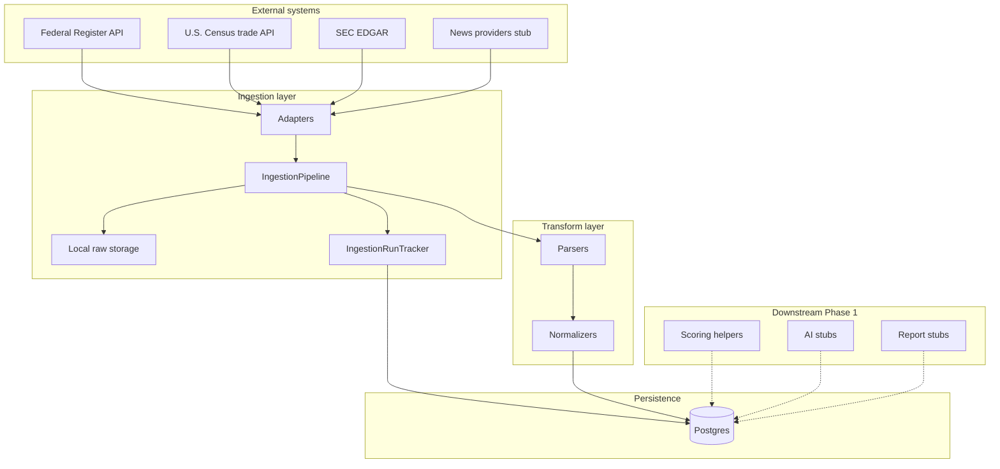

# Architecture overview

This project implements a **reports-first** backend: ingest and normalize heterogeneous sources into Postgres, emit preliminary **risk events**, and expose an **internal FastAPI** for orchestration. Customer-facing SaaS and auth are out of scope for Phase 1.

## Layered architecture



**Design intent**

1. **Adapters** only talk to the outside world (HTTP or stub) and return **`FetchBundle`** objects (raw bytes + logical `items`). They do not write to the database.
2. **`IngestionPipeline`** is the single orchestrator: merge config, track runs, persist raw payloads, upsert `source_documents`, write domain rows (`regulations`, `trade_flows`, …), and attach **risk events**.
3. **Parsers** turn source-specific dicts into small internal dataclasses (e.g. `ParsedRegulation`).
4. **Normalizers** resolve geography, materials, suppliers, and turn parsed content into **`RiskEventDraft`** structures before ORM insert.
5. **Scoring** is synchronous, explainable, and **not** wired automatically into every ingest today; it is ready to populate `supplier_scores` and reports.
6. **Reports** and **AI** modules are **interfaces + stubs** so OpenAI or other providers can replace local logic without reshaping the pipeline.

## Phased sources

| Phase | Role | Implementation |
|-------|------|----------------|
| **1** | Federal Register, Census trade, SEC EDGAR, news stub | Live adapters + pipeline handlers |
| **2** | Sustainability PDFs, policy HTML, NGO/IEA reports | Adapter classes present; `fetch` raises `NotImplementedError` |
| **3** | NREL/AFDC charging, USITC, Canada policy | Same pattern as Phase 2 |

`Source.phase` and `sources.is_active` gate what you run in production; `ADAPTER_BY_TYPE` always maps type → class so imports and typing stay valid.

## Configuration flow

Each `sources` row carries **`config_json`** (defaults for that feed). At run time:

```text
merged = {**source.config_json, **(API_or_CLI_params)}
```

The pipeline merges CLI/API `extra` into the same dict before calling **`adapter.fetch(client, params=merged)`**.

## Key code locations

| Concern | Path |
|---------|------|
| Orchestration | `app/services/ingestion/pipeline.py` |
| Adapter contract | `app/services/ingestion/base.py` |
| Adapter registry | `app/services/ingestion/adapters/` |
| Run lifecycle | `app/services/ingestion/run_tracker.py` |
| Parsers | `app/services/ingestion/parsers/` |
| Normalizers | `app/services/ingestion/normalizers/` |
| Raw files | `app/utils/storage.py`, `STORAGE_ROOT` |
| ORM | `app/models/` |
| Internal HTTP API | `app/api/routes/`, `app/main.py` |
| Scoring | `app/services/scoring/` |
| AI / reports | `app/services/ai/`, `app/services/reports/` |

## Risk taxonomy

Shared categories live in `app/constants.py` (`RiskCategory`): material supply, regulatory/policy, supplier operational, market demand, infrastructure ecosystem. They appear in **`risk_events.risk_categories_json`** and inform scoring scripts.

## Related reading

- [Ingestion pipeline](ingestion-pipeline.md) — step-by-step execution
- [Parsing & normalization](parsing-and-normalization.md) — extending extractors
- [Data model & internal API](data-model-and-api.md) — tables and endpoints
