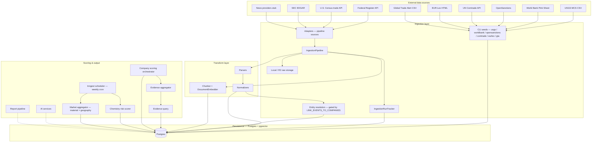

# Architecture overview

> **Last updated: April 2026**

This project implements a **supply chain intelligence** backend: ingest and normalize heterogeneous sources into Postgres, emit structured risk events, score companies across six risk pillars, score battery chemistries across a material-concentration and geopolitical risk axis, score the **market** at the material × geography intersection (the company-agnostic layer that powers the public intelligence hub), and expose an internal FastAPI for orchestration and triggering. Multi-tenancy, auth (Clerk), and customer-facing surfaces are defined in the schema and partially wired into the API layer.

## Two scoring layers

The platform deliberately separates two intelligence layers:

1. **Market layer (company-agnostic).** Scores at every material × geography pair using only criticality signals + risk events + commodity prices. Output: `material_geography_risk_scores`. Powers the public intelligence hub (`mineralriskanalytics.com`) and is the only layer that ingestion writes into directly.
2. **Company layer (paid overlay).** Six-pillar scores per company that blend market signals with the customer's configured exposure profile. Output: `company_scores`. Triggered on demand or via a scoring run; not produced automatically by ingestion (see "Phase 3 architecture change" below).

Phase 3 (April 2026) decoupled ingestion from company scoring: events still land in `risk_events`, but the writer no longer fans them out to `risk_event_companies`. The junction table, ORM model, and helpers are intentionally retained — the gate is a single feature flag in `app/services/ingestion/feature_flags.py`.

## Layered architecture



**Design intent**

1. **Adapters** only talk to the outside world and return **`FetchBundle`** objects (raw bytes + logical items). They do not write to the database.
2. **`IngestionPipeline`** is the single orchestrator for pipeline-based sources: merge config, track runs, persist raw payloads, upsert `source_documents`, write domain rows, and attach risk events via entity resolution.
3. **CLI-based ingestors** (USGS, World Bank, OpenSanctions, Comtrade, EUR-Lex, GTA) operate outside the pipeline and write directly to domain tables. They are idempotent and callable via `uv run bdi-ingest <command>`.
4. **Entity resolution** (`app/services/ingestion/entity_resolution.py`) is the single source of truth for which companies relate to a given `RiskEvent`. As of Phase 3, the writer that materialises those relations into `risk_event_companies` is gated by `LINK_EVENTS_TO_COMPANIES` (default `False`); the helper logs a `WARNING` with the suppressed-row count when it short-circuits. Phase 5 will re-enable it once company exposure profiles drive relevance.
5. **Parsers** turn source-specific dicts into small internal dataclasses (`ParsedRegulation`, `ParsedFiling`, etc.).
6. **Normalizers** resolve geography, materials, and companies, and produce **`RiskEventDraft`** structures for ORM insert.
7. **Document embedder** chunks `source_documents.raw_text` and stores 1536-dim vectors in `document_chunks.embedding` (pgvector) for semantic search.
8. **Company scoring orchestrator** (`app/services/scoring/orchestrator.py`) is invoked on demand (CLI `rescore-all` / `POST /companies/{id}/rescore`). It queries evidence, aggregates inputs, scores all six pillars, and appends a `company_scores` row. **Phase 3 removed the post-ingestion auto-rescore hook** — ingestion no longer triggers company scoring.
9. **Chemistry risk scorer** (`app/services/scoring/chemistry_risk.py`) scores battery chemistries across material concentration and geopolitical risk axes. Triggered via `bdi-ingest rescore-chemistry` or the weekly Inngest cron. Writes append-only `chemistry_risk_scores` rows.
10. **Market aggregator** (`app/services/scoring/market_aggregator.py`) scores every active material × geography pair into `material_geography_risk_scores`. Triggered via `bdi-ingest rescore-market` or the weekly Inngest cron. Uses a market-specific pillar weight set (no propagation; financial pressure reframed as commodity-price volatility).
11. **Inngest scheduler** (`app/core/inngest.py` + `app/tasks/scoring_jobs.py`) registers two weekly cron jobs (Mondays 02:00 / 03:00 UTC) for the chemistry and market layers. The serve route is exposed at `/api/inngest`.
12. **Reports** and **AI** modules are interfaces + stubs so OpenAI or other providers can replace local logic without reshaping the pipeline. The new `insight_posts` table backs the public intelligence hub with manually authored content.

## Phased sources

| Phase | Role | Implementation |
|-------|------|----------------|
| **1** | Federal Register, Census trade, SEC EDGAR, news stub | Live adapters + pipeline handlers |
| **1** | USGS MCS, World Bank Pink Sheet, OpenSanctions, UN Comtrade | Live CLI commands (not pipeline adapters) |
| **1** | EUR-Lex (EU regulations), Global Trade Alert (export controls) | Live CLI commands — write `regulations` and `risk_events` directly |
| **2** | Sustainability PDFs, policy HTML, NGO/IEA reports | Adapter classes present; `fetch` raises `NotImplementedError` |
| **2** | EPO PATSTAT, IEA Critical Minerals, EU CRM Act | Planned — will write to `material_criticality_signals` |
| **3** | NREL/AFDC charging, USITC, Canada policy | Same pattern as Phase 2 |

`Source.phase` and `sources.is_active` gate what runs via the pipeline. CLI-based sources (USGS, World Bank, OpenSanctions, Comtrade) bypass the `sources` registry and are triggered directly.

See [Data sources](data-sources.md) for a complete source-by-source reference.

## Risk taxonomy (`RiskCategory`)

Five pillars defined in `app/constants.py` (scoring v2). Old v1 values are retired:

| v2 value (current) | v1 value (retired) |
|--------------------|-------------------|
| `MATERIAL_CONCENTRATION` | `MATERIAL_SUPPLY` |
| `GEOPOLITICAL_TRADE` | `MARKET_DEMAND`, `INFRASTRUCTURE_ECOSYSTEM` |
| `REGULATORY_COMPLIANCE` | `REGULATORY_POLICY` |
| `OPERATIONAL` | `SUPPLIER_OPERATIONAL` |
| `FINANCIAL_PRESSURE` | — (new in v2) |

These values appear in `risk_events.risk_categories_json` (JSONB array) and drive which evidence window and decay function applies during scoring.

## Configuration flow

Each `sources` row carries **`config_json`** (defaults for that feed). At run time:

```text
merged = {**source.config_json, **(API_or_CLI_params)}
```

The pipeline merges CLI/API `extra` into the same dict before calling `adapter.fetch(client, params=merged)`.

## Key code locations

| Concern | Path |
|---------|------|
| Pipeline orchestration | `app/services/ingestion/pipeline.py` |
| Adapter contract | `app/services/ingestion/base.py` |
| Adapter registry | `app/services/ingestion/adapters/` |
| USGS MCS ingestor | `app/services/ingestion/seeds/usgs_mcs_parser.py` |
| World Bank ingestor | `app/services/ingestion/pink_sheet.py` |
| OpenSanctions ingestor | `app/services/ingestion/opensanctions.py` |
| UN Comtrade ingestor | `app/services/ingestion/comtrade.py` |
| EUR-Lex ingestor | `app/services/ingestion/eurlex.py` |
| Global Trade Alert ingestor | `app/services/ingestion/gta.py` |
| Material seed | `app/services/ingestion/seed_materials.py` |
| HS mapping seed | `app/services/ingestion/seed_hs_mappings.py` |
| Entity resolution | `app/services/ingestion/entity_resolution.py` |
| Ingestion feature flags | `app/services/ingestion/feature_flags.py` |
| Document chunker | `app/services/ingestion/chunker.py` |
| Document embedder | `app/services/ingestion/document_embedder.py` |
| Run lifecycle | `app/services/ingestion/run_tracker.py` |
| Parsers | `app/services/ingestion/parsers/` |
| Normalizers | `app/services/ingestion/normalizers/` |
| Raw file storage | `app/utils/storage.py` (`STORAGE_ROOT`) |
| ORM models | `app/models/` |
| Internal HTTP API | `app/api/routes/`, `app/main.py` |
| Market scores router | `app/api/routes/market_scores.py` |
| Company scoring functions | `app/services/scoring/` |
| Evidence query | `app/services/scoring/evidence_query.py` |
| Evidence aggregation | `app/services/scoring/evidence_aggregator.py` |
| Company scoring orchestrator | `app/services/scoring/orchestrator.py` |
| Chemistry risk scorer | `app/services/scoring/chemistry_risk.py` |
| Market aggregator | `app/services/scoring/market_aggregator.py` |
| Inngest client | `app/core/inngest.py` |
| Scheduled scoring jobs | `app/tasks/scoring_jobs.py` |
| Embedding service | `app/services/ai/embeddings.py` |
| AI / reports | `app/services/ai/`, `app/services/reports/` |
| CLI commands | `app/cli.py` |

## Related reading

- [Data sources](data-sources.md) — every source, current and planned, with table and score mappings
- [Database architecture](database_architecture.md) — full table reference
- [Ingestion pipeline](ingestion-pipeline.md) — step-by-step execution and the `LINK_EVENTS_TO_COMPANIES` gate
- [Scoring](scoring.md) — six-pillar formulas, market-layer scoring, chemistry risk scoring, scheduled rescores
- [Data model & internal API](data-model-and-api.md) — HTTP surface including `/api/v1/market/*` and the Inngest serve route
